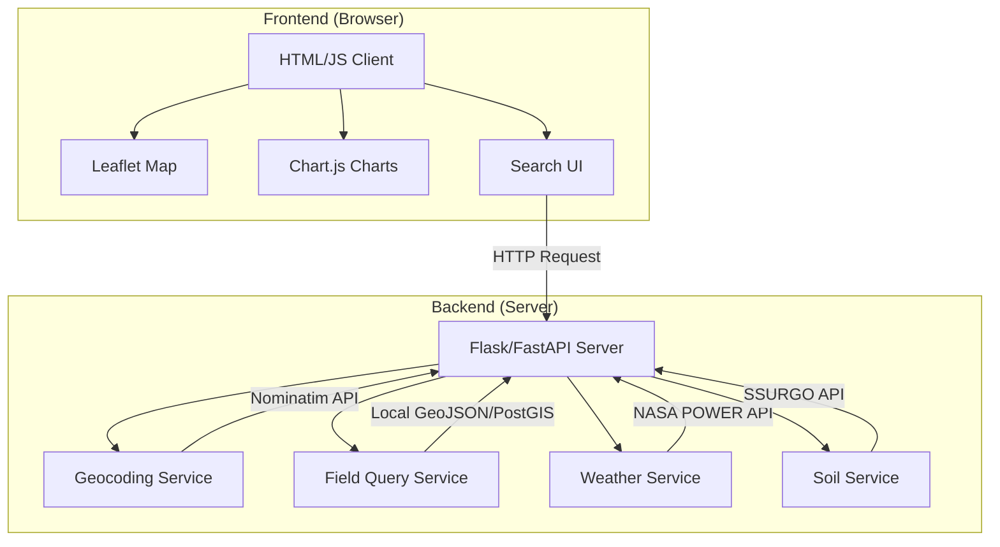
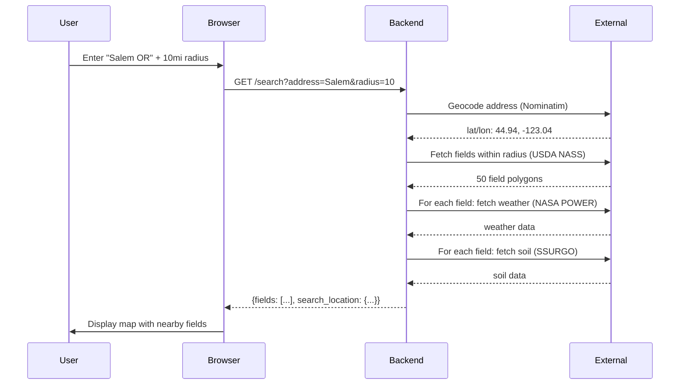

# Server-Based Field Map Design

_Design document for Option C: dynamic field discovery with backend API_

---

## Overview

This document details the architecture, implementation options, and trade-offs for a server-based field map application. Unlike the embedded HTML approach (field_map_3, field_map_4), this version fetches field data, weather, and soil dynamically from external APIs based on user search queries.

The goal: allow users to discover **any** agricultural field in the US (not just pre-loaded data), with temperature, rainfall, and soil properties displayed on demand.

---

## Problem Statement

Current implementation (field_map_3/field_map_4):

- Field data is pre-loaded at build time (~50 fields)
- User can only search within this fixed dataset
- New fields require re-running the build script
- Geographic coverage is limited to the Willamette Valley

Desired implementation:

- User searches any US address
- Backend finds fields within a user-specified radius
- Data fetched dynamically: field boundaries + weather + soil
- Unlimited geographic coverage (not limited by pre-loaded data)

---

## Architecture Overview

The server-based approach consists of two components:



### Data Flow



---

## Backend Implementation Options

### Option C1: Flask with Local GeoJSON

**Stack:** Python Flask + GeoPandas + local GeoJSON file

**How it works:**

1. Pre-download field boundaries (~500-1000 fields) to a local GeoJSON file
2. Flask server loads GeoJSON at startup
3. On search request: geocode address → filter GeoJSON by radius → fetch weather/soil for matching fields
4. Return combined results to client

**Pros:**

- Simple to implement (familiar Python stack)
- Fast queries for small dataset (< 1000 fields)
- No external database required
- Easy to run locally

**Cons:**

- Limited by pre-downloaded fields (still not truly unlimited)
- Must re-download to add new fields
- Single-threaded by default (use Gunicorn for concurrency)

**Estimated setup time:** 2-4 hours

```python
# Simplified server structure (Flask)
from flask import Flask, request, jsonify
import geopandas as gpd
from shapely.geometry import Point

app = Flask(__name__)
fields = gpd.read_file('data/fields_us.geojson')

@app.route('/search')
def search():
    address = request.args.get('address')
    radius_miles = float(request.args.get('radius', 10))

    # 1. Geocode address
    lat, lon = geocode(address)  # calls Nominatim

    # 2. Filter fields by radius
    user_point = Point(lon, lat)
    nearby = fields[fields.geometry.distance(user_point) <= radius_miles]

    # 3. Fetch weather + soil for each field
    results = []
    for _, field in nearby.iterrows():
        weather = fetch_weather(field.centroid)
        soil = fetch_soil(field.geometry)
        results.append({...field.props, weather, soil})

    return jsonify(results)
```

---

### Option C2: FastAPI with PostgreSQL/PostGIS

**Stack:** FastAPI + PostgreSQL + PostGIS extension

**How it works:**

1. Load field boundaries into PostGIS database
2. Use PostGIS spatial queries for efficient radius filtering
3. Weather and soil still fetched from external APIs
4. Cache results in database to avoid repeat API calls

**Pros:**

- Handles thousands of fields efficiently (spatial index)
- Concurrent request handling (FastAPI is async)
- Caching layer reduces API calls
- Production-ready scalability

**Cons:**

- Requires PostgreSQL + PostGIS setup
- More complex infrastructure
- Additional hosting requirements

**Estimated setup time:** 4-8 hours

```python
# Simplified server structure (FastAPI)
from fastapi import FastAPI
import asyncpg

app = FastAPI()

@app.get("/search")
async def search(address: str, radius: float):
    # 1. Geocode
    lat, lon = await geocode(address)

    # 2. PostGIS spatial query
    rows = await pool.fetch("""
        SELECT * FROM fields
        WHERE ST_DWithin(geometry, ST_Point($1, $2)::geography, $3 * 1609)
    """, lon, lat, radius)

    # 3. Fetch weather/soil (async)
    results = await asyncio.gather(*[
        fetch_field_data(row) for row in rows
    ])

    return results
```

---

### Option C3: Serverless Functions (Vercel/AWS Lambda)

**Stack:** Vercel Serverless Functions or AWS Lambda

**How it works:**

1. Deploy API as serverless functions
2. Field boundaries stored in S3 or Cloudflare KV
3. Each search invocation fetches data on-demand
4. Weather/soil cached in Redis or in-memory

**Pros:**

- Auto-scales to handle traffic spikes
- Pay only for what you use
- No server maintenance
- Global CDN for fast responses

**Cons:**

- Cold start latency (first request slow)
- Limited execution time (usually 10-30 seconds)
- More complex debugging
- Requires cloud account (AWS/Vercel)

**Estimated setup time:** 6-10 hours

---

### Option C4: Edge/CDN with Pre-cached Data

**Stack:** Cloudflare Workers + pre-computed data

**How it works:**

1. Pre-compute field data for major US cities/regions
2. Store in Cloudflare KV or similar edge cache
3. Search requests served from edge (very fast)
4. Fall back to API for less common areas

**Pros:**

- Sub-100ms response times globally
- Very cheap at scale
- No cold starts

**Cons:**

- Complex pre-computation pipeline
- Limited geographic resolution
- Still needs fallback for non-cached areas

**Estimated setup time:** 8-12 hours

---

## Comparison Matrix

| Aspect               | C1: Flask + GeoJSON | C2: FastAPI + PostGIS | C3: Serverless        | C4: Edge/CDN    |
| -------------------- | ------------------- | --------------------- | --------------------- | --------------- |
| **Setup complexity** | Low                 | Medium                | High                  | Very High       |
| **Fields supported** | ~500-1000           | Unlimited             | Unlimited             | Pre-cached only |
| **Query speed**      | Fast (<100ms)       | Very Fast (<50ms)     | Variable (cold start) | Fast (<50ms)    |
| **Infrastructure**   | Local or VPS        | PostgreSQL server     | Cloud platform        | Cloudflare      |
| **Hosting cost**     | $0-20/mo            | $20-50/mo             | $0-30/mo (free tier)  | $5-20/mo        |
| **Scalability**      | Limited             | High                  | Auto-scale            | Very High       |
| **Maintenance**      | Low                 | Medium                | Low                   | Medium          |
| **Offline capable**  | Partial             | No                    | No                    | No              |

**Recommendation for this project:** Start with **C1 (Flask + GeoJSON)** for fastest implementation. Can upgrade to C2 or C3 later if more scale is needed.

---

## External API Dependencies

The backend relies on three external APIs:

### 1. Geocoding: Nominatim (OpenStreetMap)

| Attribute  | Value                                        |
| ---------- | -------------------------------------------- |
| Endpoint   | `https://nominatim.openstreetmap.org/search` |
| Auth       | None (rate-limited)                          |
| Rate limit | 1 request/second                             |
| Cost       | Free                                         |

**Usage:** Convert user-entered address to lat/lon coordinates.

---

### 2. Weather: NASA POWER

| Attribute  | Value                                                  |
| ---------- | ------------------------------------------------------ |
| Endpoint   | `https://power.larc.nasa.gov/api/temporal/daily/point` |
| Auth       | None                                                   |
| Rate limit | Polite pool (1 req/sec recommended)                    |
| Cost       | Free                                                   |
| Parameters | T2M, T2M_MAX, T2M_MIN, PRECTOTCORR                     |

**Usage:** Fetch temperature and precipitation data for field centroids.

---

### 3. Soil: NRCS Soil Data Access (SSURGO)

| Attribute  | Value                                                      |
| ---------- | ---------------------------------------------------------- |
| Endpoint   | `https://sdmdataaccess.sc.egov.usda.gov/Tabular/post.rest` |
| Auth       | None                                                       |
| Rate limit | 5 requests/second                                          |
| Cost       | Free                                                       |
| Data       | Clay%, Sand%, Silt%, OM%, pH, CEC, drainage                |

**Usage:** Fetch soil properties for field polygons.

---

### 4. Field Boundaries: USDA NASS Crop Sequence Boundaries

| Attribute | Value                                                                        |
| --------- | ---------------------------------------------------------------------------- |
| Source    | [USDA NASS Crop Sequence Boundaries](https://nassgeodata.gmu.edu/CropScape/) |
| Format    | GeoJSON (via skill)                                                          |
| Coverage  | Contiguous US                                                                |
| Update    | Annual                                                                       |

**Usage:** Source of field polygon data.

---

## API Design

### Endpoint: `/search`

**Request:**

```
GET /search?address=Salem%20OR&radius=10
```

**Response:**

```json
{
  "search_location": {
    "lat": 44.9429,
    "lon": -123.0351,
    "display_name": "Salem, Oregon, USA"
  },
  "fields": [
    {
      "field_id": "OR_123456",
      "crop_name": "Winter Wheat",
      "area_acres": 45.2,
      "distance_miles": 3.2,
      "geometry": "...",
      "weather_avg_monthly": {
        "avg_high_c": [8, 9, 11, 15, 18, 20, 24, 25, 23, 17, 11, 9],
        "avg_low_c": [3, 1, 2, 5, 8, 10, 12, 12, 10, 7, 4, 2],
        "avg_rain_in": [4.5, 3.2, 3.8, 2.1, 1.5, 1.2, 0.3, 0.2, 1.5, 2.8, 4.5, 5.1]
      },
      "soil": {
        "clay_pct": 24,
        "sand_pct": 18,
        "silt_pct": 58,
        "om_pct": 4.2,
        "ph": 6.1,
        "cec": 22,
        "drainage": "Well drained",
        "muname": "Salkum silty clay loam"
      }
    }
  ]
}
```

### Error Handling

| Error                | HTTP Code   | Message                                                             |
| -------------------- | ----------- | ------------------------------------------------------------------- |
| Address not found    | 404         | "Address could not be geocoded. Try a more specific location."      |
| No fields in radius  | 200 (empty) | "No fields found within {radius} miles. Try increasing the radius." |
| External API failure | 502         | "Unable to fetch field data. Please try again."                     |
| Rate limited         | 429         | "Too many requests. Please wait and try again."                     |

---

## Caching Strategy

To reduce API calls and improve performance:

| Layer                | Cache Strategy                                    |
| -------------------- | ------------------------------------------------- |
| **Geocoding**        | Cache address → lat/lon in SQLite (TTL: 30 days)  |
| **Weather**          | Cache per field + year in SQLite (TTL: 1 year)    |
| **Soil**             | Cache per field permanently (soil doesn't change) |
| **Field boundaries** | Re-download monthly (cron job)                    |

---

## Frontend Requirements

The HTML client remains similar to field_map_4:

| Component       | Description                                     |
| --------------- | ----------------------------------------------- |
| Search panel    | Address input + radius dropdown + search button |
| Map             | Leaflet with satellite basemap                  |
| Field popups    | Temperature, rainfall, soil charts              |
| Legend          | Auto-generated crop colors                      |
| Status messages | Loading, error, results count                   |

---

## Deployment Options

### Local Development

```bash
# Run Flask server
python server.py
# Access at http://localhost:5000/field_map_5.html
```

### Self-Hosting (VPS)

- DigitalOcean Droplet: $5/mo
- Run with Gunicorn + Nginx

### Cloud Platforms

| Platform | Free Tier | Notes                 |
| -------- | --------- | --------------------- |
| Render   | Yes       | Easy Flask deployment |
| Railway  | Yes       | Simple, scales        |
| Fly.io   | Yes       | Good for containers   |
| Vercel   | Yes       | For serverless option |

---

## Security Considerations

1. **API rate limiting** — Implement on backend to prevent abuse
2. **Input validation** — Sanitize address input, validate radius range
3. **Error messages** — Don't expose internal API details to users
4. **CORS** — Configure properly if serving from different origins

---

## Future Enhancements

After initial implementation, consider:

- [ ] Add more field data sources (FSA, state agricultural agencies)
- [ ] Implement user accounts for saved searches
- [ ] Add field comparison feature (side-by-side)
- [ ] Export data as CSV/GeoJSON
- [ ] Mobile-optimized UI
- [ ] Add more weather parameters (solar radiation, humidity)

---

## Summary

The server-based approach (Option C) enables truly dynamic field discovery across the entire US. The recommended implementation path:

1. **Start with C1 (Flask + local GeoJSON)** — fastest to implement, handles ~500 fields
2. **Upgrade to C2 (FastAPI + PostGIS)** if more scale is needed
3. **Move to C3 (Serverless)** if public deployment with auto-scaling is required

The trade-off is complexity: embedded (Option A) is simpler but limited; server-based is more complex but delivers unlimited field discovery.

---

## References

- [NASA POWER API Documentation](https://power.larc.nasa.gov/docs/)
- [NRCS Soil Data Access](https://sdmdataaccess.nrcs.usda.gov/)
- [USDA NASS Crop Sequence Boundaries](https://nassgeodata.gmu.edu/CropScape/)
- [Nominatim Usage Policy](https://nominatim.org/release-docs/develop/api/Search/)
- [Flask Documentation](https://flask.palletsprojects.com/)
- [FastAPI Documentation](https://fastapi.tiangolo.com/)
